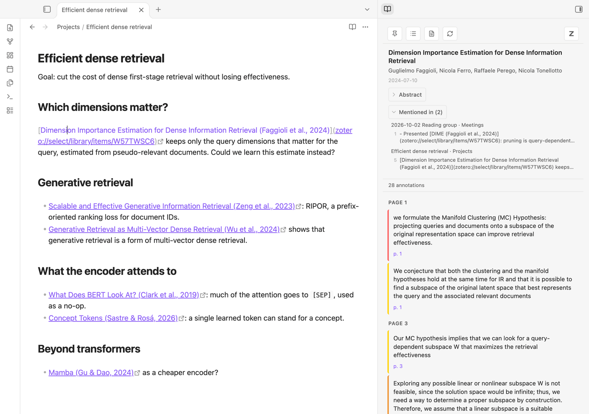
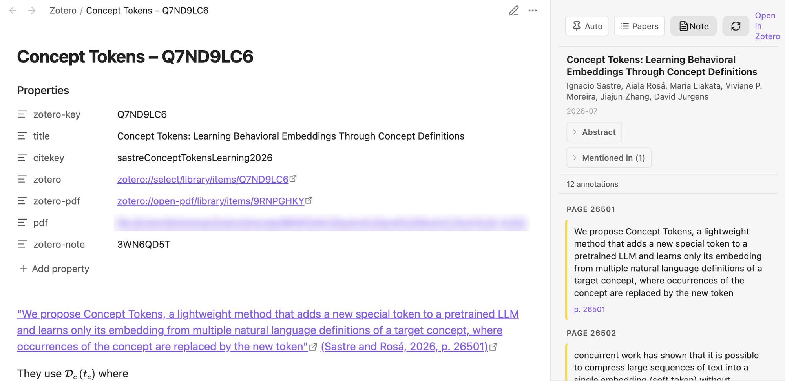
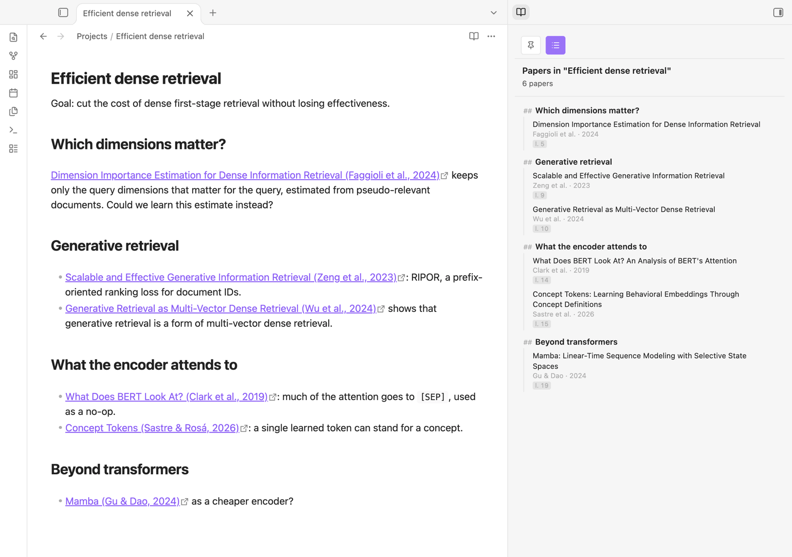
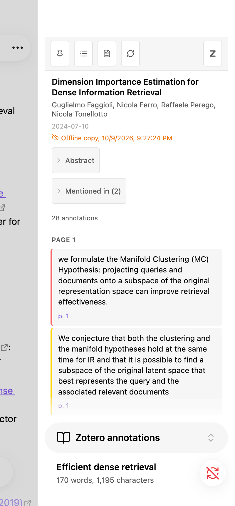

# Zotero Annotations

An Obsidian plugin that automatically shows Zotero PDF annotations in a sidebar when your cursor is on a `zotero://select/library/items/ITEMKEY` link.



*With the cursor on a Zotero link, the sidebar shows the paper: its abstract, the notes that mention it, and its Zotero notes and annotations.*



*With a literature note open, the sidebar shows that paper's annotations, grouped by page. The note itself holds the paper's Zotero note, where quotes and citations link back to the PDF.*



*The **Papers** button lists the papers a note cites, along its headings. Click one to see its annotations.*



*On a phone or tablet, tapping a Zotero link opens the sidebar too, from the copy of the annotations kept in the paper's literature note.*

<br clear="right">

## Features

- **Automatic sidebar**: Place your cursor on a Zotero link (or inside a markdown link `[text](zotero://...)`) and the sidebar opens with that paper's annotations
- **Click interception**: Clicking a `zotero://select/` link opens the sidebar instead of switching to Zotero (double-click to open it in Zotero)
- **Papers in a note**: the **Papers** button lists the papers cited in the current note, grouped under its headings
- **Paper metadata**: Title, authors, date, and collapsible abstract
- **Notes**: Zotero notes are displayed (expanded by default) with embedded images
- **Annotations**: Highlights, comments, and tags grouped by page, with colored sidebar matching the annotation color
- **Image annotations**: Area highlights are rendered from the Zotero cache
- **Pin/freeze**: Pin the sidebar to keep the current annotations while you navigate
- **PDF links**: Click a page number to open the PDF at that page in Zotero
- **Caching**: Annotations are cached in memory to avoid repeated API calls
- **Literature notes** (optional): one note per paper holding its Zotero notes, kept in sync with Zotero in both directions — see below
- **Drag and drop**: drag an annotation from the sidebar into a note to quote it with a link back to the PDF
- **Dead links repaired**: a link to an item merged into another (or deleted) can be pointed at the item that replaced it — see below

## Requirements

- Obsidian desktop to talk to Zotero. On mobile (or when Zotero is not running), the sidebar shows the copy of the annotations kept in literature notes — see below
- **Zotero 7+** running locally (Zotero 10+ to send literature note edits back to Zotero)
- Zotero's local API enabled: **Settings → Advanced → "Allow other applications on this computer to communicate with Zotero"**

## Getting Zotero links

The plugin reacts to two kinds of links:

- a paper: `zotero://select/library/items/ITEMKEY`
- an annotation: `zotero://open-pdf/library/items/ATTACHMENTKEY?page=3&annotation=ANNOTATIONKEY`

Zotero has no built-in command to copy them, but the [Actions & Tags](https://github.com/windingwind/zotero-actions-tags) add-on can, with a script. [**Actions & Tags examples**](docs/actions-tags.md) has ready-made actions — copy a Zotero link, a Markdown link, or an annotation as a quote — to import in one go ([`actions-tags.yml`](docs/actions-tags.yml)) or create one by one:

1. Install Actions & Tags: download the `.xpi` from its [latest release](https://github.com/windingwind/zotero-actions-tags/releases/latest), then in Zotero **Tools → Add-ons → ⚙ → Install Add-on From File…**
2. In **Zotero Settings → Actions & Tags**, import [`actions-tags.yml`](docs/actions-tags.yml), or click **+** and create an action with **Event** None, **Operation** Script, and as **Data** the [Copy Zotero links script](docs/actions-tags.md#copying-zotero-links)
3. Give it a **Shortcut**, select a paper in the library — or an annotation in the PDF reader's sidebar — run the action (shortcut or right-click menu), and paste into Obsidian.

The plugin's settings link to the same page, under **Getting Zotero links**.

## Literature notes

Turn on **Settings → Zotero Annotations → Literature notes** to keep one note per paper in the vault. A literature note is identified by its `zotero-key` frontmatter property (as in [ZotLit](https://github.com/aidenlx/zotlit)) and looks like this:

```markdown
---
zotero-key: ABCD1234
title: …
citekey: …
zotero: zotero://select/library/items/ABCD1234
zotero-pdf: zotero://open-pdf/library/items/EFGH5678
pdf: file:///…/paper.pdf
zotero-note: NOTEKEY
authors:
  - Jane Doe
  - John Smith
keywords:
  - dense retrieval
---

The Zotero child note, as Markdown     ← refreshed from Zotero while you haven't edited it
```

When the paper has several Zotero notes, each one gets its own section instead (and `zotero-note` goes away):

```markdown
%%zt-note: NOTEKEY%%
A Zotero child note, as Markdown
%%/zt-note%%
```

- **Creating notes**: on demand (the **Note** button in the sidebar, or the "Open literature note…" command), when the cursor lands on a link to the paper, or for every paper linked from the vault — see the **Create notes** setting. The automatic modes only create notes for papers that have Zotero notes; an empty note is only made on demand.
- **Sync**: the plugin asks Zotero what changed since the last check (every minute by default, when Obsidian regains focus, and when a literature note is opened) and updates only the affected notes. It never reads Zotero's database directly — everything goes through the local API.
- **Annotations** are not copied into the note: the sidebar shows them, and follows the literature note you have open.
- **Names**: new notes are named "Short title – KEY" (e.g. "Don t Forget Your Embeddings – CEW9LK4V"); the title is cut at the first ":" and to 6 words (both configurable).
- **Refresh**: the sidebar's refresh button, the note's file menu ("Refresh from Zotero") or the "Refresh literature note from Zotero" command re-reads the paper from Zotero.
- **Authors**: the `authors` property lists the paper's authors ("First Last"), refreshed from Zotero. Edit the list in Obsidian (add, remove, reorder; "Last, First" for a new name with a last name of several words) and the plugin asks before sending it to Zotero: a notice with a **Review** link once you stop typing for 30 s, a question when you leave the note, or with "Send literature note edits to Zotero". Editors and other creators are not listed, and kept as they are.
- **Keywords**: the `keywords` property lists the paper's Zotero tags, synced both ways without asking: tags added or removed in Obsidian are added or removed in Zotero, and the other way round (changes made on both sides are merged).
- **Properties**: title, citation key and links are properties, refreshed from Zotero: `zotero` selects the paper in Zotero (in its own literature note, clicking it opens Zotero rather than the sidebar), `zotero-pdf` opens the PDF in Zotero's reader, `pdf` opens the file itself. The body holds only your text and the Zotero notes.
- **Your edits are safe**: text outside the `zt-note` sections is never touched (a note holding a single Zotero note has no such text: the whole body is the note). A note or `zt-note` section you edited in Obsidian is not overwritten: it is sent to Zotero (when you leave the note, after 30 s without typing, or with "Send literature note edits to Zotero"; the first time, Zotero asks for permission — choose "Always allow"). If the note changed in Zotero too, you choose which version to keep. A new `%%zt-note%%` section (without key), or the text of a note for a paper without Zotero notes, becomes a new Zotero note. Images go along (PNG and JPEG; Zotero imports them when the note is opened in Zotero). Deleting a `zt-note` section (or emptying a single-note body) keeps it out of the note. Holding exactly one Zotero note and nothing else, a note drops its markers.
- **Links between papers**: in a Zotero note section, a wikilink to another literature note — `[[RePo Language Models with Context Re-Positioning – U8NBCFLN|RePo: Language Models with Context Re-Positioning]]` — becomes a citation of its paper in Zotero, with the link's text (or the note name). The other way round, a Zotero citation of a paper that has a literature note (without a page number) becomes a wikilink to that note, with the citation's text: `[[… – U8NBCFLN|(Li et al., 2025)]]`. Other citations stay `zotero://select` links.
- **Images** inside Zotero notes are copied to the image folder.
- **Offline copy**: a literature note ends with a `zotero-annotations` block holding what the sidebar shows (paper details and annotations, as JSON; image annotations are copied to the image folder). It is shown as a single line ("12 Zotero annotations, copy of …") and cannot be edited in Obsidian. When Zotero cannot be reached — on your phone, or with Zotero closed — the sidebar shows this copy, marked "Offline copy". It is updated with the note, when the annotations change in Zotero.

### Merged or deleted items

When Zotero merges duplicates, it keeps one item and moves the others to the trash, so links to them stop working. For such a link, the sidebar shows **Find the current item** (also for an item in the trash); the "Repair links to deleted or merged Zotero items" commands check every paper link of the current note, or of the whole vault — malformed keys included (a key that is not 8 characters). Items merged in Zotero (Zotero records which item was kept) are relinked right away: every link to the old item in the vault points at the item kept, and its literature note moves to it (`zotero-key`, name) and is refreshed from it — unless the item kept has a literature note already, in which case the report says so.

A report lists what was done, followed by the items Zotero has no record for. For each one it shows what is known of it (from Zotero's trash, else from its literature note: title, authors, year; else from the text of its links), its literature note, the notes linking to it, and a search of your library. Select the queries to combine — title, first author and year, the titles and citations of its links, e.g. "Suslik 2026" — or type one; the item most like it is marked "best match". You can also search the web for it (Google Scholar, Semantic Scholar, Google). Pick the item with **Use this item**; nothing changes before. Items are searched when the report opens, unless you turn **Search automatically** off — then **Search all** searches them all at once. Clicking a note in the report opens it, with a notice to go back to the report (or use "Show the last report of Zotero link repairs"); it comes back as you left it, searches included. Its text can be selected and copied.

### On mobile

Zotero only runs on a computer, so on a phone or tablet the plugin works from the vault: the sidebar shows the offline copy of the paper's literature note (only papers with a literature note), the "Mentioned in" section and the Papers list work as on desktop, and tapping a `zotero://select` link shows the paper in the sidebar, as on desktop (its **Note** button opens the literature note). Nothing is sent to Zotero from mobile; edits made there are sent by the computer once the notes are synced to it.

## Network use and files outside the vault

- **Network**: the plugin only talks to Zotero running on your own computer, through its local API (`http://localhost:23119`). Nothing is sent to any remote server, and there is no telemetry.
- **GitHub**: when a note cannot be converted safely for Zotero, the plugin offers to open a pre-filled GitHub issue in your browser. That issue contains the note's text; it is only submitted if you click "Submit" on GitHub yourself.
- **Files outside the vault** (read-only, through Node's `fs`): Zotero's local API serves neither the images of area annotations nor the files of images embedded in notes, so the plugin reads them in Zotero's data directory (set in the plugin settings, `~/Zotero` by default): annotation images in `cache/library/`, note images in `storage/` (at the path the API gives). They are shown in the sidebar, and copied into the vault when you drag an annotation into a note, or for literature notes (images in their Zotero notes, and every image annotation for the offline copy). The plugin never writes outside the vault.
- **Vault notes**: to list the notes that mention a paper ("Mentioned in"), the plugin reads the Markdown notes of the vault, looking for `zotero://` links. The index is kept in the plugin's folder (`mention-index.json`) and never leaves your computer.

## Installation

### From Obsidian

**Settings → Community plugins → Browse**, search for "Zotero Annotations", install and enable it.

### Manual

1. Download `main.js`, `manifest.json` and `styles.css` from the [latest release](https://github.com/bpiwowar/obsidian-zotero-annotations/releases/latest)
2. Copy them to `<vault>/.obsidian/plugins/zotero-annotations/`
3. Enable the plugin in Obsidian: **Settings → Community plugins → Zotero Annotations**

### Development

1. Clone the repository
2. `npm install`
3. Create a `.obsidian-plugin-dir` file containing the path to your vault's plugin directory:
   ```
   /path/to/vault/.obsidian/plugins/zotero-annotations
   ```
4. `npm run watch` — rebuilds on every file change
5. Install the [Hot Reload](https://github.com/pjeby/hot-reload) plugin and run `touch .hotreload` in the vault's plugin directory for automatic reloading

You can also set the `OBSIDIAN_PLUGIN_DIR` environment variable instead of using the `.obsidian-plugin-dir` file.

## Commands

| Command | Description |
|---|---|
| Toggle Zotero Annotations sidebar | Show/hide the sidebar |
| Pin/Unpin annotations sidebar | Freeze the sidebar so cursor movements don't update it |
| Refresh current annotations | Clear the cache and re-fetch annotations for the current item |
| Open literature note of the paper in the sidebar | Opens the paper's literature note, creating it if needed |
| Refresh literature note from Zotero | Re-reads the active literature note's paper from Zotero |
| Send literature note edits to Zotero | Sends the Zotero notes of the active literature note to Zotero |
| Sync changed literature notes with Zotero | Updates every literature note whose paper changed in Zotero |
| Refresh all literature notes from Zotero | Re-reads every literature note from Zotero, changed or not (sections edited in Obsidian are kept); also adds the offline copy to older notes |
| Send all literature note edits to Zotero | Sends the edited sections of every literature note to Zotero, asking when a note changed on both sides |
| Sync all literature notes with Zotero | Sends all edits, then refreshes all literature notes |
| Repair links to deleted or merged Zotero items in current note | Points the note's links to items no longer in Zotero (merged, deleted) at the items that replaced them, in the whole vault |
| Repair links to deleted or merged Zotero items in all notes | The same for every Zotero link of the vault |
| Show the last report of Zotero link repairs | Reopens the last repair report as you left it |

## Known limitations

- Only personal libraries are supported (`users/0`). Group libraries use a different API path.
- Image annotations require access to the Zotero data directory (`~/Zotero/cache/library/`). If your Zotero data directory is in a non-default location, images won't load.

## License

MIT
